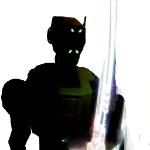
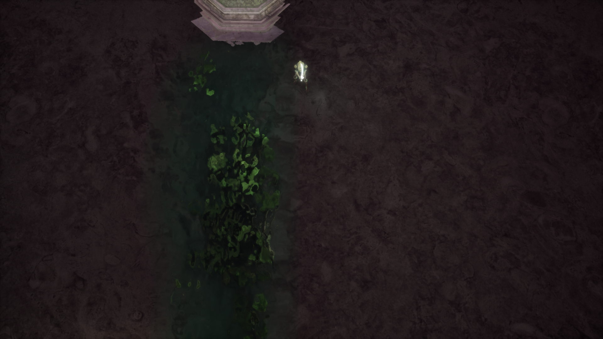
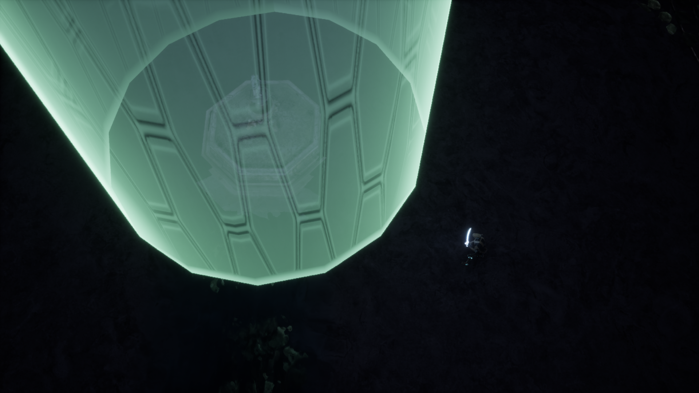
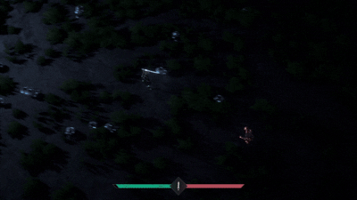
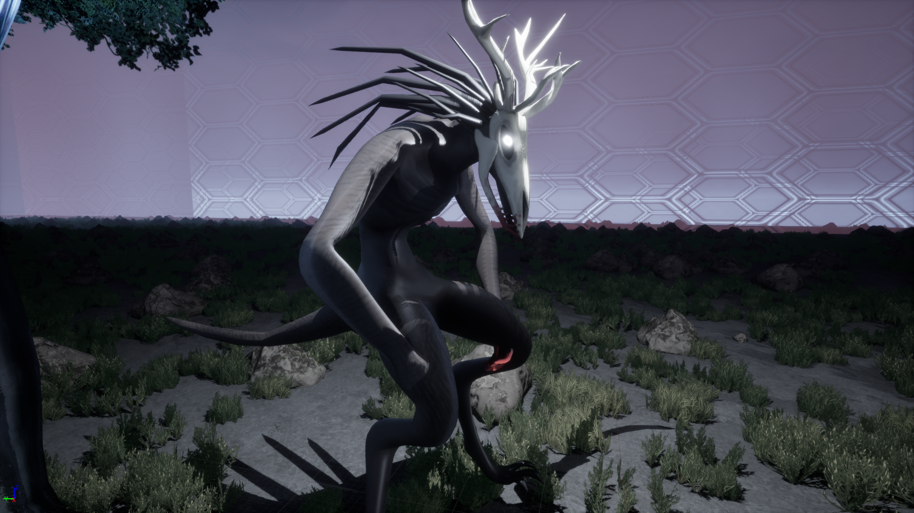
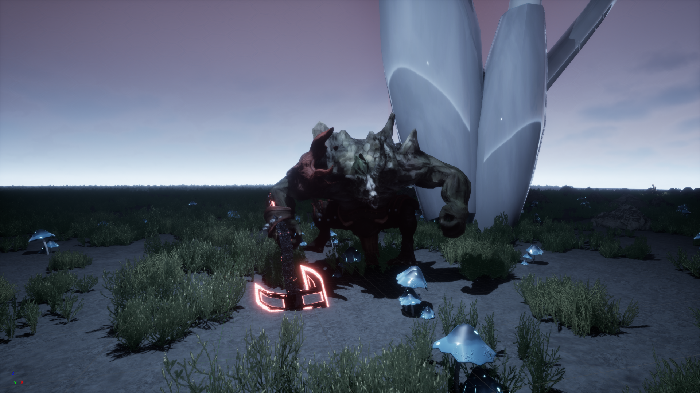
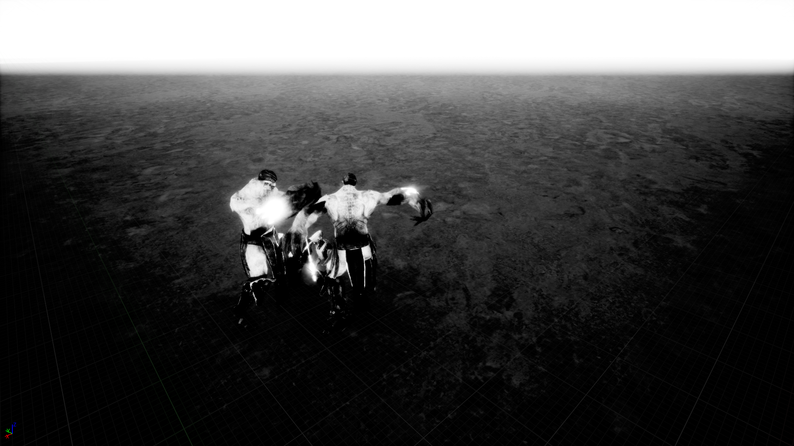
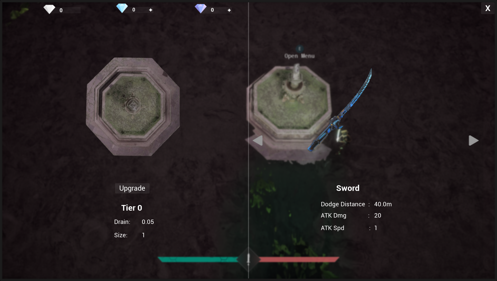

#  Light’s Wager

A top-down action game for **Brackeys Game Jam 2025.2** built in **Unreal Engine 5** for the theme **_Risk it for the biscuit_**

  
  

---

## About

_Lights Wager_ is a fast-paced 3D top-down combat game about leaving safety behind to hunt powerful bosses.

Defeat them to claim light shards and ultimately ascend.

You start inside a fragile **Safe Zone** powered by a Core. Outside its barrier, the world is corrupted and crawling with enemies. Step out to fight and explore, but the longer you stay away, the faster your safe zone will collapse.

Your only way forward is to risk everything.

---

## Zone System

- Lush green area that heals the player when inside
- Heals player when inside
- Enemies petrify if they enter, so they avoid it (sometimes they get stuck)
- The zone shrinks when the player leaves, only replenishing once they return
- The longer you stay out, the faster it drains

---

## Core System

- Enemies drop **Cores** which can be used at the altar to upgrade your Safe Zone
- Combine 4 cores of the same tier to craft the next tier
- Tiers range from **1–3**
- If the zone fully depletes, the player must upgrade it to the next tier to replenish it (or use a Tier 3 core if already maxed)

---

## Bosses

### 1. Wendigo

- Located by following the river downstream
- Fast paced melee fighter, often jump attacking the player to close the distance
- Drops light shard

  

### 2. Axed Werewolf

- Located by following the glowing mushrooms all the way to the base
- Slower axe wielding fighter who does high amounts of damage
- Drops light shard and axe

### 3. Final boss duo

---

- Obtain both the light shards and interact with the final ascension altar to "ascend", transporting you to the light realm
- Two beings who fight with their claws using their numbers and high health pool to their advantage, even dodging the players attacks occasionally

---

## Weapons

- Balanced starter sword

- Fast paced scythe with lower attack damage, obtained by defeating the special enemy spawned by approaching the strange hut with the glowing light

- Axe with a very high attack damage, at the cost of a lot of attack speed and your ability to dodge, obtained from defeating the axed werewolf

---
